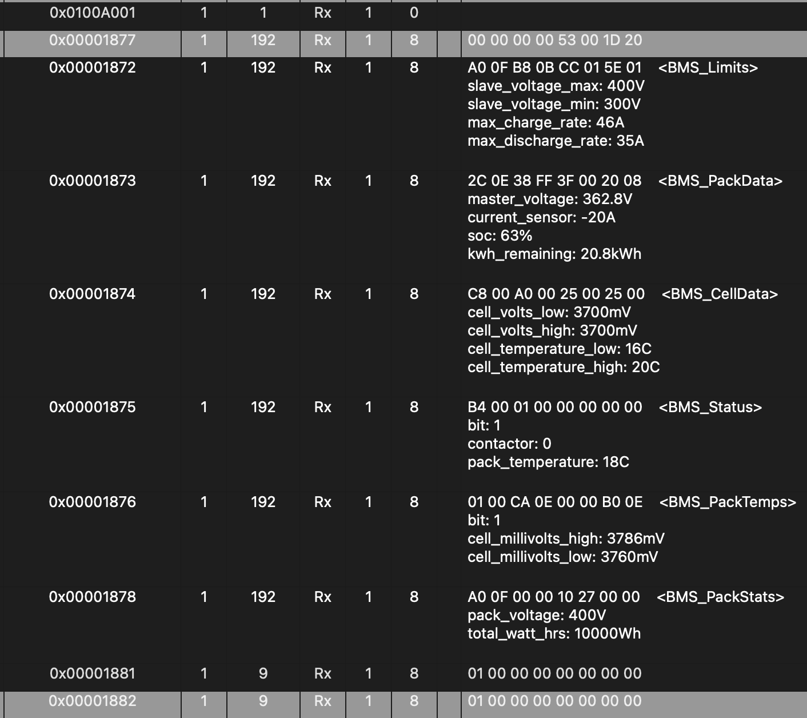

# Solax/FoxESS V1 Hybrid/Fit/AC Can Bus Protocol

Can bus @ 500k - all Extended ID, little endian

## Frames

### Received frame 

> 0x1871 [0x01,  0x00,  0x01,  0x00,  0x00,  0x00,  0x00,  0x00]

### Response frames

| ID     | b0                | b1                | b2                | b3                | b4           | b5           | b6               | b7              |
| ------ | ----------------- | ----------------- | ----------------- | ----------------- | ------------ | ------------ | ---------------- | --------------- |
| 0x1872 | slave_voltage_max | slave_voltage_max | slave_voltage_min | slave_voltage_min | charge_max   | charge_max   | discharge_max    | discharge_max   |
| 0x1873 | voltage           | voltage           | current           | current           | capacity     | capacity     | kwh              | kwh             |
| 0x1874 | cells_temp_max    | cells_temp_max    | cells_temp_min    | cells_temp_min    | cells_mv_max | cells_mv_max | cells_mv_min     | cells_mv_min    |
| 0x1875 | int_temp          | int_temp          | 0x01              | 0x00              | 0x01         | 0x00         | cell_voltage_min | 0x00            |
| 0x1876 | 0x01              | 0x00              | cells_volts_max   | cells_volts_max   | 0x00         | 0x00         | cells_volts_min  | cells_volts_min |
| 0x1877 | 0x00              | 0x00              | 0x00              | 0x00              | id           | 0x00         | byte1            | byte2           |
| 0x1878 | pack_voltage_max  | pack_voltage_max  | 0x00              | 0x00              | wh_total     | wh_total     | wh_total         | wh_total        |

## Screenshot

